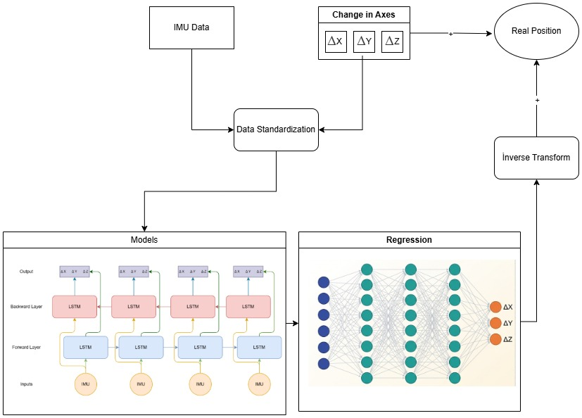

# Delta Inertial UAV Localization

> **Deep Learning-Based UAV Position Estimation Using IMU Sensor Data During GPS Loss**

This repository contains the dataset, source code, and trained model results associated with the paper:

**"Deep Learning-Based UAV Position Estimation Using IMU Sensor Data During GPS Signal Loss"**

---

## Overview

This study proposes a deep learning framework that directly estimates incremental position changes (Δx, Δy, Δz) from raw IMU sensor data during GPS outages. Four recurrent architectures — LSTM, BiLSTM, GRU, and AHLSTM — are systematically compared using a flight-wise training and evaluation protocol on nine independent UAV flight trajectories recorded in the Webots simulation environment.



---

## Repository Structure

```
├── models.py               # Model definitions: LSTM, BiLSTM, GRU, AHLSTM
├── trainseqcon.py          # Training script (flight-wise protocol)
├── dataset/                   # Flight trajectory CSV files (9 flights)
└── README.md
```

---

## Models

All model architectures are defined in `models.py`:

| Model    | Description                                      |
|----------|--------------------------------------------------|
| LSTM     | Long Short-Term Memory                           |
| BiLSTM   | Bidirectional LSTM                               |
| GRU      | Gated Recurrent Unit                             |
| AHLSTM   | Attention-based Hierarchical LSTM                |

All models share the same configuration:
- Input size: 16
- Hidden size: 256
- Number of layers: 2
- Output size: 3 (Δx, Δy, Δz)
- Dropout: 0.4

---

## Training Protocol

Each flight is treated as an independent experimental unit:
- **First 80%** of each flight → training
- **Last 20%** of each flight → test (GPS loss simulation)

The scaler is fit only on the training portion of each flight to prevent data leakage.

---

## Getting Started

### Requirements

```bash
pip install torch scikit-learn pandas numpy matplotlib openpyxl
```

### Running the Training

```python
python trainseqcon.py
```

The script will:
1. Load all flight CSV files from the `data/` directory
2. Train each model independently on each flight (9 flights × 4 models = 36 sessions)
3. Save model weights, loss curves, trajectory plots, and metrics under `results/`

Upon successful execution, the following output structure will be generated:

```
results/
  flight_01/ ... flight_09/
    LSTMModel / BiLSTMModel / GRUModel / AHLSTMModel
      *_model.pth
      *_losses.csv
      *_loss_curve.png
      *_scenario_2d.png
      *_scenario_3d.png
      *_scenario_axes.png
      *_results.xlsx
  summary/
    all_results.xlsx
    statistics.xlsx
    comparison_plots/
```

> **Note:** The `results/` directory is not included in this repository due to file size. Run the training script to reproduce all outputs locally.

---

## Citation

If you use this code or dataset in your research, please cite:

```bibtex
@article{delta_inertial_uav_2025,
  title   = {Deep Learning-Based UAV Position Estimation Using IMU Sensor Data During GPS Signal Loss},
  year    = {2025}
}
```

---

## License

This project is open-source and available under the [MIT License](LICENSE).
